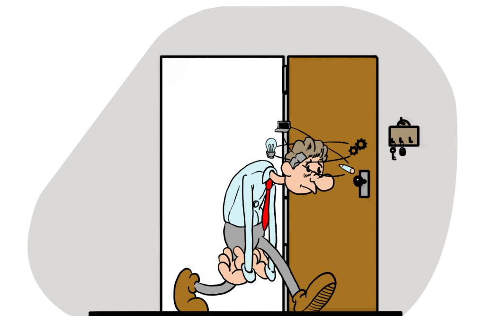

# O Manifesto do Pomodoro Reverso

> *"A produtividade não é uma virtude; é uma patologia da qual precisamos ser protegidos."*

A tecnologia moderna foi desenhada com um único objetivo: otimizar a extração do nosso tempo e da nossa energia. Cada aplicativo, notificação e ferramenta de gestão tem como premissa que você *deve* fazer mais. 

Este projeto nasce de uma premissa oposta. No nosso universo algorítmico, **a produtividade é um risco emocional e biológico**. Tentar abrir o VS Code, o Terminal ou o Excel fora de hora não é um sinal de dedicação, mas um sintoma de perigo. Este sistema é o seu agente pessoal de redução de danos.

## 1. A Sociedade do Cansaço e a Auto-exploração

O alicerce deste projeto baseia-se na teoria do filósofo sul-coreano **Byung-Chul Han**, especificamente em sua obra *Sociedade do Cansaço*. Han argumenta que o século XXI substituiu o modelo disciplinar (onde o chefe nos obriga a trabalhar) pelo modelo de desempenho (onde nós nos obrigamos a trabalhar). 

Nós nos tornamos carrascos de nós mesmos sob a falsa ilusão de "realização pessoal" e "propósito". Quando você sente a necessidade incontrolável de abrir uma planilha às 22h, você não está sendo produtivo; você está sofrendo de auto-exploração. O nosso aplicativo age como uma barreira física contra você mesmo, impedindo que o sujeito do desempenho destrua sua própria saúde mental.

## 2. O que é burnout?

O “burnout” é uma palavra da língua inglesa que pode ser traduzida como “esgotamento”. O burnout ocorre como uma resposta do corpo para as multitarefas – ato de realizar múltiplas atividades ao mesmo tempo – que causa desgaste físico e psíquico.

A OMS caracteriza o Burnout através de três dimensões principais:

1. Exaustão Física e Mental
É a sensação de esgotamento absoluto de energia. A pessoa sente que suas reservas físicas e emocionais foram drenadas, tornando muito difícil lidar com as demandas diárias. O cansaço não passa, mesmo após o fim de semana ou um período de descanso.

2. Distanciamento e Cinismo (Despersonalização)
Ocorre um aumento do distanciamento mental em relação ao próprio trabalho. A pessoa passa a ter sentimentos negativos, de indiferença, apatia ou até cinismo em relação às suas tarefas, colegas e clientes. O trabalho perde o sentido.

3. Redução da Eficácia Profissional
Há uma queda perceptível no rendimento e na produtividade. A pessoa começa a sentir que não é mais capaz de realizar suas tarefas com a mesma competência de antes, desenvolvendo sentimentos de incompetência e falta de realização.

Principais Sintomas
Os sintomas do Burnout vão além do psicológico e frequentemente se manifestam de forma física:

    - Sintomas Físicos: Fadiga crônica, dores de cabeça frequentes, insônia, alterações no apetite, dores musculares, problemas gastrointestinais e baixa imunidade.

    - Sintomas Psicológicos e Comportamentais: Ansiedade constante, irritabilidade, dificuldade de concentração, alterações bruscas de humor, isolamento, pessimismo e sensação de derrota.

O Burnout é o ápice do estresse prolongado não gerenciado no ambiente profissional, muitas vezes gerado por excesso de responsabilidades, falta de controle sobre as próprias tarefas, metas inatingíveis, falta de reconhecimento ou um ambiente de trabalho tóxico.

## 3. O Direito à Preguiça

Historicamente, o descanso foi demonizado. Em *O Direito à Preguiça* (1883), o pensador **Paul Lafargue** atacou frontalmente o "amor insano pelo trabalho" que adoece a humanidade. Lafargue defendia que a obsessão por produzir exaure a força vital e que a verdadeira liberdade só existe no ócio.

Mais tarde, o filósofo e matemático **Bertrand Russell**, em seu ensaio *O Elogio ao Ócio* (1932), reforçou que a crença de que o trabalho é uma virtude causou enormes danos à sociedade. Russell propunha que a tecnologia deveria servir para diminuir nossa carga de trabalho, não para nos manter acorrentados a ela. 

O nosso sistema leva essa teoria à sua conclusão lógica: se a tecnologia nos falhou ao não nos dar o ócio prometido, nós vamos forçá-lo via software.

## 4. Tradução Técnica: O Pomodoro Reverso

A mecânica do aplicativo é a materialização direta dessa filosofia. A técnica Pomodoro tradicional (25 minutos de hiperfoco, 5 minutos de pausa) assume que o descanso é apenas um recarregamento rápido para voltar à exploração. Nós subvertemos essa lógica.

**Nossas Regras de Negócio Filosóficas:**
*   **O Descanso é o Estado Padrão (Default):** O aplicativo não "inicia uma sessão de trabalho". Ele inicia o *Mandato de Descanso*. A normalidade é não estar fazendo nada.
*   **Contenção de Danos (Intervenção):** Abrir IDEs, editores de texto ou terminais dispara um alerta de "Risco de Burnout Detectado". O sistema intervém interceptando a janela, exatamente como um antivírus interceptaria um malware. O trabalho é tratado como o vírus.
*   **Decaimento da Janela Produtiva:** Quando o sistema cede uma janela de produtividade, ela é curta. A cada ciclo que passa, o algoritmo entende que o seu risco biológico aumenta. Portanto, as janelas de trabalho encolhem e as janelas de descanso se expandem. O sistema vai, progressivamente, sufocando a sua capacidade de trabalhar até que você desista.

## Conclusão

Não estamos construindo uma ferramenta para ajudar você a gerenciar seu tempo. Estamos construindo um escudo algorítmico contra o imperativo do desempenho. A melhor linha de código é aquela que o sistema não deixou você escrever porque você precisava dormir.